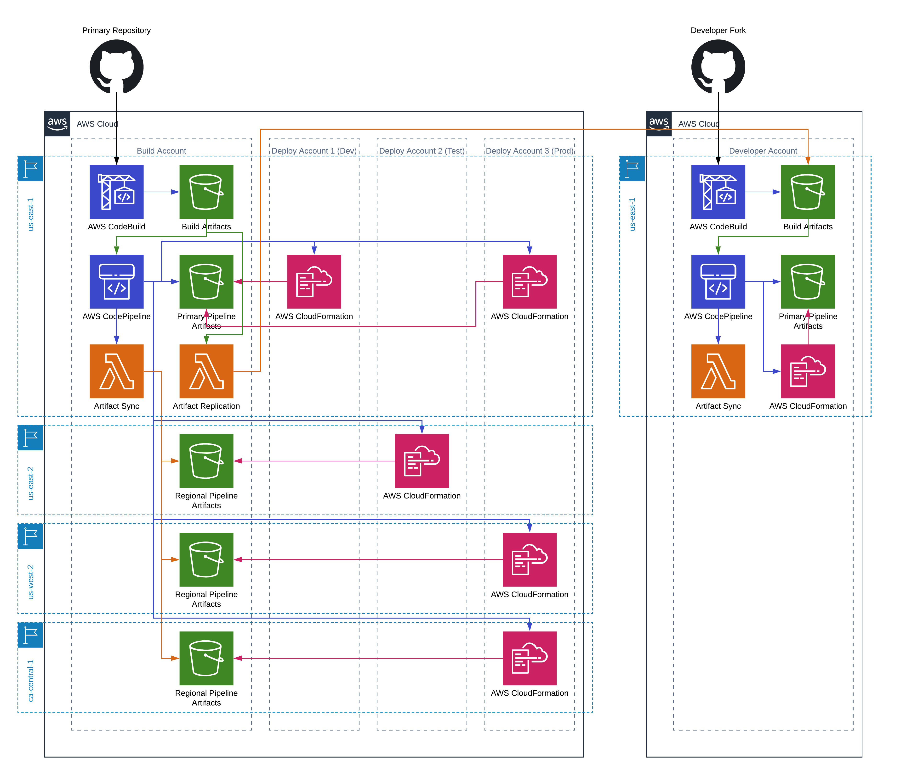

Cross Account Pipeline
============================

This repository is designed to help build out a cross account, cross region, pipeline in AWS. It also has the ability to support developer accounts, to facilitate developer testing and experimenting without impacting others.

There are definitely some areas for improvement:
- There are permissions that are not nearly as tight as they should be. With time (and maybe some help) I hope to tighten these down to only grant what is absolutely necessary.
- The current version doesn't handle more than two regions. This is a limitation that can be remedied by simply adding to the `CrossAccountDeploy.yaml` file. Ideally it would use a transform so you don't have to add a new parameter for each region, but that might not be so easy.
- There needs to be some documentation on how this uses organization. This version relies heavily on organizations for managing access to the artifact buckets and KMS key. This greatly simplifies things, but it needs to be documented.

Getting started
---------------

In order to create the cross account pipeline you must follow the steps below *in order*.

Create a stack using `CrossAccountPrimary.yaml`. This should be run in the build account. This is the account where builds will run and the pipeline will live. This should be deployed in the region in which you want to perform builds and manage the pipeline. It does not need to be the same region as any of your deployments (though currently it does need to be one of the two regions you support). There is only one parameter:

- _DeploymentOrgPath_ - set this value to the path to your deployment organization (e.g. o-abcdefghij/r-h123/ou-h123-3zyxwvut/). This organization should contain all the accounts you want to deploy to.

Cross Region
------------

If any of your deployments are in regions other than the build region you will need perform an additional step for each region (NOTE: currently only one additional region is supported). These steps will need to be run once per region you are deploying to.

Create a stack using `CrossAccountRegional.yaml` in the build account, in the region you are deploying to. There is only one parameter:

- _DeploymentOrgPath_ - set this value to the path to your deployment organization (e.g. o-abcdefghij/r-h123/ou-h123-3zyxwvut/). This organization should contain all the accounts you want to deploy to.

Deployment Accounts
-------------------

Once the primary stack, and any regional stacks, are completed you will need to create a stack using `CrossAccountDeploy.yaml` in each of the accounts to which you wish to deploy (StackSets are a great way to do this, as all the values are the same). This stack can be created in any region because it only creates IAM resources, which are global. `us-east-1` is recommended. These are the paramters:

- _BuildAccount_ - set this value to the AWS Account ID of the build account
- _BuildAccountKMSKeyArn_ - set this value to the `CrossAccountCMK` export value from the `CrossAccountPrimary` stack.
- _PipelineBucket_ - set this value to the `PipelineBucket` export value from the `CrossAccountPrimary` stack
- _SecondaryPipelineBucket_ - (optional) if you have a secondary region you are deploying to set this to the `CrossAccountCMK` export value from the `CrossAccountRegional` stack for your secondary region.
- _SecondaryCrossAccountCMK_ - (optional) if you have a secondary region you are deploying to set this to the `PipelineBucket` export value from the `CrossAccountRegional` stack for your secondary region.

> NOTE: currently the `CrossAccountDeploy.yaml` only supports a two region deployment. We hope to expand upon that soon.

That is all that is needed to create a pipeline that is cross account/cross region. For an example pipeline that uses the values above please look at the `ExampleProjectPipelineSimple.yaml`.

Developer Account
-----------------
NOTE: this section is currently not accurate. We will be adding this support back in soon.

If you are running in a developer account you'll want to take some steps to be sure things are always up to date in your account.

First, go through the steps of creating a cross account pipeline, treating your developer account as both the build account and the deployment account (you'll only deploy to one account), but you'll want to make a few small changes.

In the primary stack:
- you'll need to add the "real" build account's root account ARN to the _RootAccountArns_ parameter.

You'll also need to run the `CrossAccountDeveloper.yaml` in the developer account. It has one parameter:
- _ReplicationFunctionRoleArn_ - the role ARN from the primary account's replication function

In the "real" build account you'll need to modify the replication settings:
- add your artifact bucket to the _ReplicationBucketList_ parameter.
- add your artifact bucket to the _ReplicationBucketStarArns_ parameter.
- add your CMK to the _ReplicationCMKs_ parameter.

Once this is done you will have a bucket that gets data both from your account's builds and the "real" build account's builds. This will keep your account in sync at all times, whilst allowing you to test on a private fork.

Note On GitHub
----------------
The ExampleProject project uses a GitHub hook for CodeBuild. This hook uses an OAuth connection to AWS, so no GitHub credentials are stored in AWS. In order to configure this you'll need to go to the CodeBuild page and start the process of creating a build project. Follow the directions in [this article](https://www.itonaut.com/2018/06/18/use-github-source-in-aws-codebuild-project-using-aws-cloudformation/) for direction of what you need to do (just the last part of the article).

**_NOTE_**: Some of the permission grants in this code are beyond what you should grant. For example, in order to simplify the build/deploy the grants in the `CrossAccountDeploy.yaml` are very open (`CrossAccount-CloudFormationRole` is granted `arn:aws:iam::aws:policy/AdministratorAccess`). You should tighten these permissions to match the permissions you wish to have on your deployment process.
